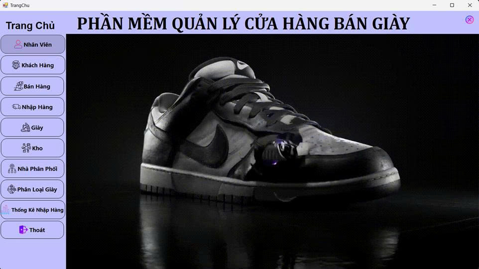
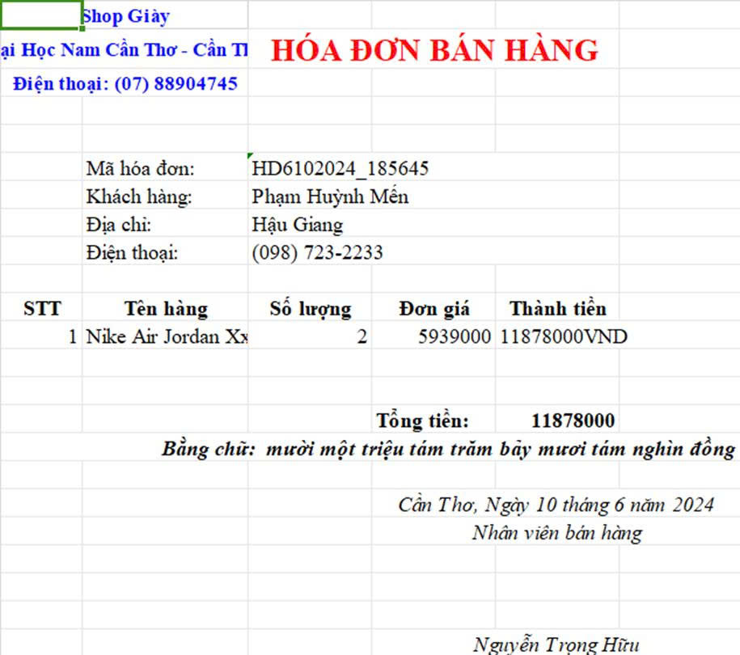

# 👟 Shoe-Store - Ứng dụng quản lý cửa hàng giày

Dự án xây dựng **ứng dụng WinForms quản lý cửa hàng giày**, hỗ trợ quản lý sản phẩm, khách hàng, nhân viên, hóa đơn và báo cáo doanh thu.

---

## 👨‍💻 Thành viên nhóm
- **Nguyễn Trọng Hữu** - 211591  
- **Võ Thanh Hữu** - 211621  

---

## 📌 Lý do chọn đề tài
- Kinh doanh giày dép ngày càng phát triển, nhu cầu quản lý hiệu quả rất lớn.  
- Nhiều cửa hàng hiện vẫn quản lý thủ công → dễ nhầm lẫn, khó tra cứu.  
- Ứng dụng quản lý bán hàng giúp **tự động hóa**, tiết kiệm thời gian và nâng cao hiệu quả kinh doanh.  

---

## ✨ Tính năng chính
- **Quản lý sản phẩm**: thêm, sửa, xóa, tìm kiếm sản phẩm.  
- **Quản lý khách hàng**: lưu trữ thông tin khách hàng, chăm sóc khách hàng.  
- **Quản lý nhân viên**: theo dõi thông tin nhân sự, phân quyền truy cập.  
- **Hóa đơn bán hàng**: lập hóa đơn, tính tiền nhanh chóng.  
- **Báo cáo doanh thu**: thống kê theo ngày/tháng/năm.  
- **Đăng nhập phân quyền**: bảo mật thông tin.  

---

## 🛠 Công nghệ sử dụng
- **Ngôn ngữ**: C# (.NET WinForms)  
- **Cơ sở dữ liệu**: SQL Server  
- **Mô hình**: 3-layer (GUI - Business - Data Access)  
- **Công cụ**: Visual Studio 2022, SQL Server Management Studio  

---

## 🚀 Cài đặt & chạy thử
1. Clone repo về máy:
   ```bash
   git clone https://github.com/nguyentronghuu753itpro/Shoe-Store.git

Khởi động SQL Server, tạo database và import file backup QLCHBanGiay.bak.
Mở project .sln bằng Visual Studio.
Sửa chuỗi kết nối trong file App.config nếu cần:
```
<connectionStrings>
  <add name="ShoeStoreDB"
       connectionString="Data Source=.;Initial Catalog=QLCHBanGiay;Integrated Security=True" />
</connectionStrings>

```
Chạy chương trình (F5).

### 📈 Kết quả đạt được
Ứng dụng hỗ trợ quản lý đầy đủ cho cửa hàng giày.
Giao diện thân thiện, dễ sử dụng.
Dữ liệu tập trung trong SQL Server, dễ tra cứu và thống kê.
Hỗ trợ chủ cửa hàng quản lý kinh doanh hiệu quả.

### 🔮 Hướng phát triển

Tích hợp bán hàng online, đồng bộ với website.
Quản lý tồn kho và báo cáo nâng cao.
Hỗ trợ in hóa đơn trực tiếp.
Xuất báo cáo sang Excel/PDF.
Phát triển thêm phiên bản web hoặc mobile.

📷 Demo giao diện





### Lời cảm ơn

Nhóm xin chân thành cảm ơn thầy/cô đã hướng dẫn và hỗ trợ trong quá trình thực hiện đề tài.


---

README này trình bày rõ ràng: Giới thiệu – Thành viên – Tính năng – Công nghệ – Cách chạy – Kết quả – Hướng phát triển.

